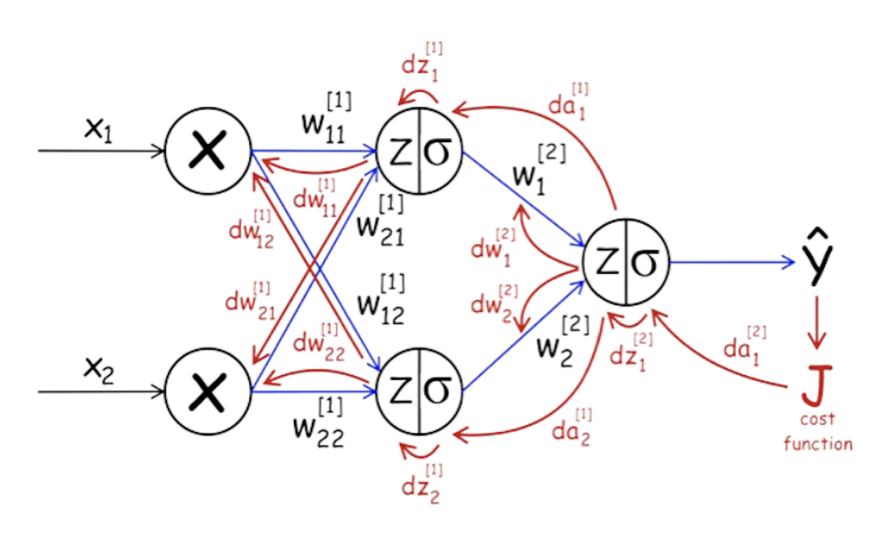
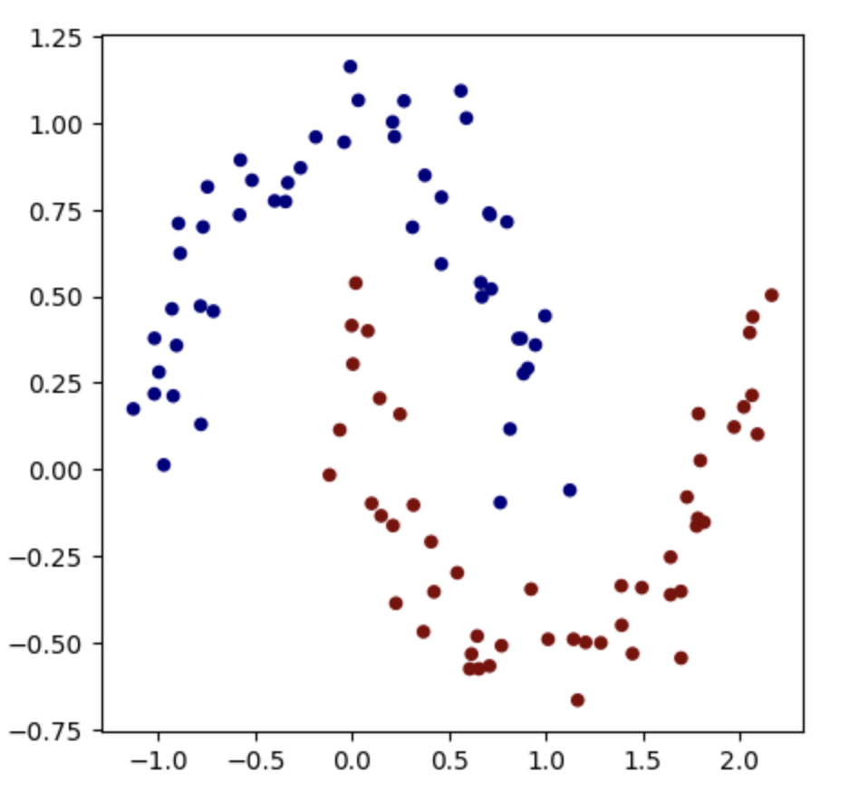

# micrograd | A Deep Neural Net from scratch (in Java)

A good first repo to understand the basics of a Deep Neural Net.

## Topics Covered

1. [Introduction](#introduction)
2. [Value class to visualize Mathematical equations](#value-a-class-representing-mathematical-equation)
3. [Structure of a Neural Network](#structure-of-a-neural-network)
      
    1. [Neuron](#neuron)
    2. [Layer](#layer)
    3. [Multi-layer Perceptron](#multilayer-perceptron)

4. [Backpropagation](#backpropagation)

    1. [Understanding the Mathematics involved](#understanding-the-mathematics-involved)

5. [Training Micrograd on the Binary Classifier sample](#training-micrograd-on-the-binary-classifier-sample)
6. [Reference](#reference)
 
## Introduction

**micrograd** is an Autograd engine developed by [Andrej Kerpathy](https://github.com/karpathy). This repo covers the **Java** implementation of [micrograd](https://github.com/karpathy/micrograd). We will start with building a **Value** class which allows us to convey mathematical equations by holding the numerical terms, operators, reference to the parent terms, label and gradient. We will use the Value class to build our **Neuron** over which we will build **Layers** (collection of Neurons) and **Multilayer Perceptron** (collection of Layers) which will lay the foundation of our deep neural network.


We will start with discussing the Value class and how it can convey mathematical equations.

## Value (A class representing mathematical equation)

**Value** class is represented in the following manner.

```
class Value {
  double value;
  Value[] parent;
  double grad;
  String operator;
  String label;
}
```

We can build mathematical equations using the above **Value** object as a building block. Let’s have a sample mathematical equation as shown below:

```y = mx + c```

Let’s build the above equation using the Value class.

```
Value c = new Value(c, "c");
Value m = new Value(m, "m");
Value x = new Value(x, "x");

Value mx = m.multiply(x, "mx");
Value y = mx.add(c, "y");
```

The final Value **y** has the reference to its parents (**mx** and **c**) and so is every Value node in the equation and hence we can backtrack the entire equation. We have shown the above equation (**y = mx + c**) as a graph using Value nodes as building blocks.


Since every Value node stores the reference to their parents in the equation, we can backtrack and calculate the gradient of every variable with respect to the final result (in the above equation: y) using the [chain rule](https://en.wikipedia.org/wiki/Chain_rule).


We backtrack and use chain rule to **multiply** the gradient of the dependent terms and get the gradient of each term calculated. It is necessary to calculate the gradient of the children's nodes first before computing their parent’ gradient. To ensure this, we perform the [Topological Sorting](https://en.wikipedia.org/wiki/Topological_sorting) of the Mathematical equation graph and compute gradients in the **reverse topological order**.

## Structure of a Neural Network

### Neuron

A Neuron is a building block of our Neural Net and every Neuron object will have some **weights** and **bias**. In order to perform backtracking to compute gradients and preserve the equation, we will keep weights and bias as the **Value** class.

```
class Neuron {
  Value[] weights;
  Value bias;
}
```

A Neuron can be represented as:


Each neuron takes a collection of parameters (x) as an input and assigns weights (w) against each parameter along with a bias (b) added to the result. The equation is as follows:

```
y = w1.x1 + w2.x2 + …. wn.xn + b

```

The result is then given as an input to an **activation function** and the output is considered as the final output of that neuron which might be forwarded to another neuron.

We have used a tanh [activation function](https://paperswithcode.com/method/tanh-activation) in this repo.

```
output = tanh(y)
```

### Layer

Layer is a collection of **Neurons**. It activates each Neuron in their list and returns their output.

A Layer looks like this.


### MultiLayer Perceptron

A multi-layer perceptron is a collection of **Layers**. An MLP can have multiple Layers where the output of a layer is an input given to the subsequent layer and so on. The final result of the last layer is considered as an output of the Neural Net. We can configure the **number of layers** and the **number of neurons** present in each layer of our Neural Net architecture.

```
class MultiLayerPerceptron {
  Layer[] layers;
}
```


## Backpropagation

**Backpropagation** is the process of estimating the derivatives or gradients of the parameters present in the **Neural Network** with respect to its **Loss Function** with a goal to **minimize** the Loss value and hence increasing the **accuracy** of the model.

The method uses the concept of **Chain Rule** to determine the gradients of the parameters which are indirectly dependent (through some intermediate parameters) to the Loss Function and influence its value.

The whole idea is to calculate the gradients of the parameters with respect to the loss function and tune the parameters in the opposite direction of the gradient to reduce the loss function. This is a crucial part which happens when the **weights** and **biases** are updated post the backpropagation process.



### Understanding the mathematics involved

Let’s understand the backpropagation process with the help of a simple mathematical equation.

Here we have a mathematical equation to understand the backpropagation process. The equation is inspired from the **activation** process of a Neural Network. Let's take an example of a **Neuron** in a Neural Network fed with **3** input parameters (**x0**, **x1** and **x2**).

Now every Neuron will have **Weights** assigned to these input parameters along with a **Bias** which will be tuned as our model trains and learns the input dataset patterns. The first process is to calculate the output of the Neuron and this process is called **Forward Pass** or **Forward Propagation**.

The calculation of the output of Neuron happens as follows:

```python
y = w0.x0 + w1.x1 + w2.x2 + b
output = activation_function(y)
```

The result is fed into an **Activation Function** to get the final output of the neuron. We will consider the first part of the above calculation to understand the backpropagation process.

```python
from micrograd.engine import Value

w0 = Value(1.3, label="w0")
x0 = Value(1.6, label="x0")

w1 = Value(1.2, label="w1")
x1 = Value(0.8, label="x1")

w2 = Value(1.1, label="w2")
x2 = Value(0.5, label="x2")

b = Value(0.2, label="b")

w0x0 = w0 * x0
w0x0.label = "w0.x0"
w1x1 = w1 * x1
w1x1.label = "w1.x1"
w2x2 = w2 * x2
w2x2.label = "w2.x2"

w0x0w1x1 = w0x0 + w1x1
w0x0w1x1.label = "w0x0 + w1x1"

w0x0w1x1w2x2 = w0x0w1x1 + w2x2
w0x0w1x1w2x2.label = "w0x0 + w1x1 + w2x2"

y = w0x0w1x1w2x2 + b
y.label = "y"
```

The above code block computes the output y of the neuron. I have used the Value wrapper class to help visualize the equation we built step by step. You can checkout Andrej's [micrograd](https://github.com/karpathy/micrograd) repo to understand more about this.

Let us now visualize the above mathematical equation to understand this in-depth.


The above flowchart depicts the above mathematical equation for calculating y. This graph representation of the equation will further help us in understanding the **Backpropagation** process.

As our next step we will back-propagate though the above equation and calculate the **gradient** / derivative of each terms with respect to the final value **y**.

We will extensively use the [Chain Rule](https://en.wikipedia.org/wiki/Chain_rule) to calculate the gradient of the intermediate terms with respect to the output **y**.

The gradient of all the terms will look like this:


The gradient values in the above diagram shows the influence of each term on the final output y.

In Neural Networks we use the same backpropagation technique on our calculated Loss function. The forward pass provides the Predicted Output from the Neural Net which is then compared with the Actual Output to determine the overall loss. Then we use Backpropagation to find the derivative of the parameters (weights and biases of the neurons) with respect to the Loss function.

We finally adjust the parameters of the neural network with the help of their respective calculated gradients to minimize the overall loss.

This will look somewhat like this.

```python
for parameter in neural_net.parameters():
  parameter.data -= learning_rate * parameter.gradient
```

The entire iteration of Forward and Backward propagation (along with updating the parameters) happens multiple times until the loss gets reduced to an acceptable value.

## Training Micrograd on the Binary Classifier sample

We used a sample dataset of points scattered on a 2D plans. Each dataset row has two parameters X1 and X2 depicting the position of that point on the 2D Plane.
We also have the sample Y which classifies the dataset into red (-1) or blue (1) class.

- Traning data: [train.csv](/dataset/train.csv)
- Predictions made by the neural net: [predictions](/dataset/predictions.txt)

Training micrograd with 2 hidden layers having 16 neurons each on the above sample dataset, classified them into two categories.



## Reference

- Original repo for micrograd: [Check Out](https://github.com/karpathy/micrograd)
- [Chain Rule](https://en.wikipedia.org/wiki/Chain_rule)
- [Topological Sorting](https://en.wikipedia.org/wiki/Topological_sorting)
- [Activation Function](https://paperswithcode.com/method/tanh-activation)
- [Anrej's github](https://github.com/karpathy)

